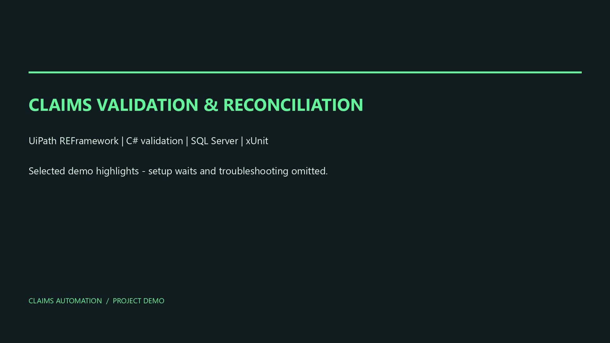
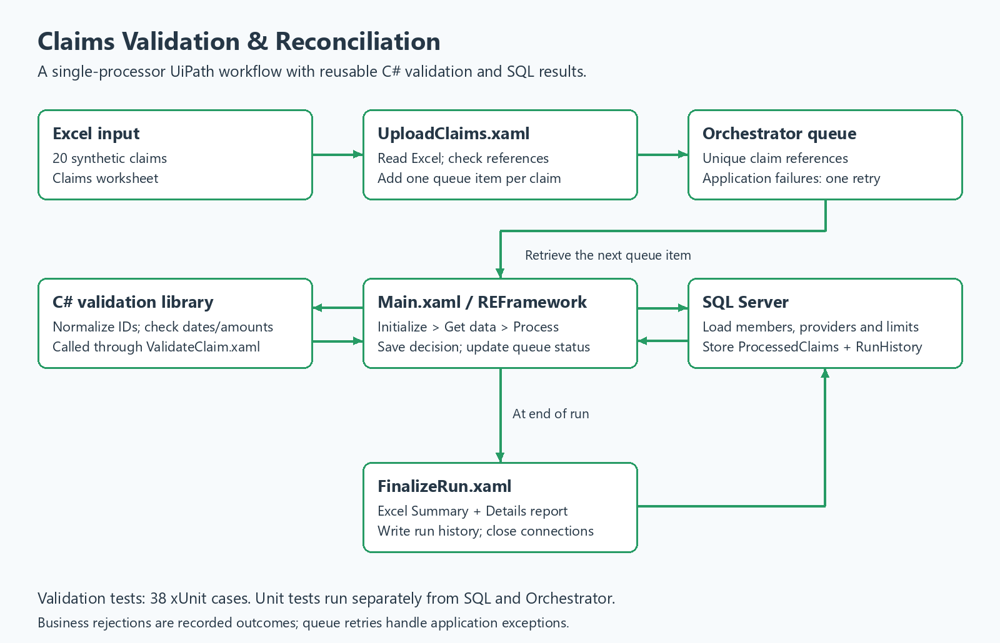
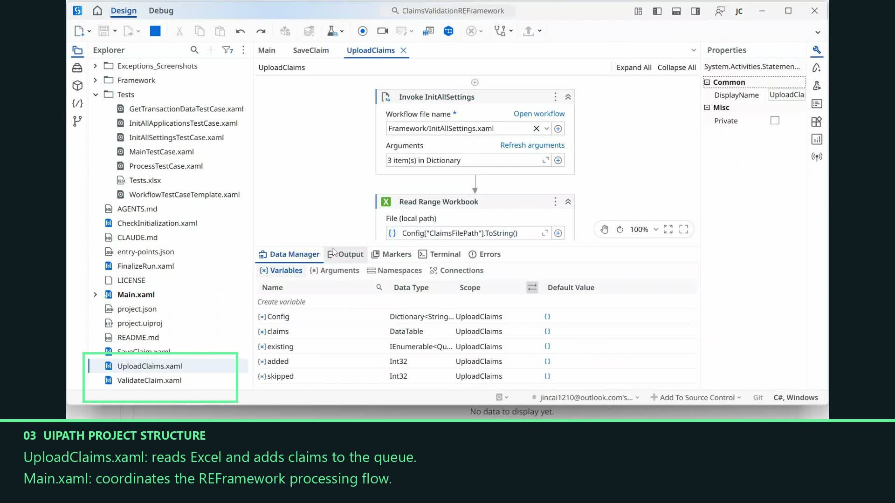
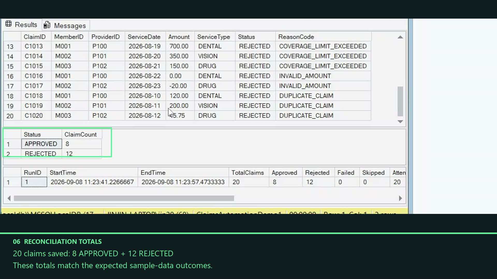
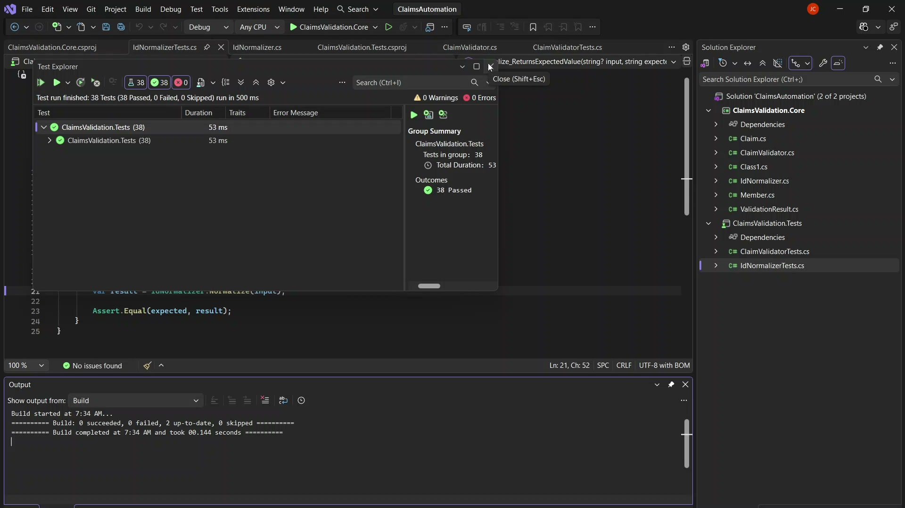

# Claims Validation & Reconciliation Bot

[](https://www.youtube.com/watch?v=kcdyJlIRxCI)

**[Watch the demo on YouTube — 5 minutes 20 seconds](https://www.youtube.com/watch?v=kcdyJlIRxCI)**

The video shows the UiPath workflow, SQL results, duplicate-upload prevention, and 38 passing xUnit tests. Green captions explain the main steps. This is an edited demonstration; the [additional checks below](#additional-checks-not-shown-in-the-demo) cover the parts not shown.

## Overview

A Windows RPA portfolio project that reads synthetic insurance claims from Excel, processes each claim through a UiPath Orchestrator queue, validates business rules using C# and SQL reference data, and generates an Excel reconciliation report.

UiPath handles the transaction flow, C# contains reusable validation logic, and SQL Server stores reference data, claim decisions, and run history. All claims, members, providers, and coverage limits are fictional.

## What it demonstrates

- **UiPath REFramework:** initialization, transaction retrieval, processing, exception handling, and cleanup.
- **Orchestrator queues:** one claim per transaction, unique references, and application-exception retries.
- **C# and LINQ:** ID normalization, date and amount checks, reference-data lookups, and consistent reason codes.
- **SQL Server:** parameterized result writes, saved-claim checks, and run-history records.
- **Excel reporting:** Summary and Details worksheets with reconciled outcome totals.
- **xUnit:** 38 tests covering validation rules, boundary conditions, and normalization.

## Architecture



The processor loads SQL reference data during initialization. Each queue item is validated, its decision is saved, and its queue status is updated. At the end of a run, the workflow writes the report and RunHistory and closes database connections. `ClaimsStaging` exists in the original schema but is not used by this queue-based processing path.

| File | Responsibility |
|---|---|
| [UploadClaims.xaml](UiPath/ClaimsValidationREFramework/UploadClaims.xaml) | Read Excel and upload claims, skipping references already queued |
| [Main.xaml](UiPath/ClaimsValidationREFramework/Main.xaml) | Coordinate REFramework and run tracking |
| [Framework/Process.xaml](UiPath/ClaimsValidationREFramework/Framework/Process.xaml) | Adapt each queue item, validate it, and save its decision |
| [ValidateClaim.xaml](UiPath/ClaimsValidationREFramework/ValidateClaim.xaml) | Check reference data and duplicates; call the C# validator |
| [SaveClaim.xaml](UiPath/ClaimsValidationREFramework/SaveClaim.xaml) | Save results with a parameterized SQL command |
| [FinalizeRun.xaml](UiPath/ClaimsValidationREFramework/FinalizeRun.xaml) | Generate the report and save SQL run history |



## Sample input and output

| Artifact | Contents |
|---|---|
| [Sample input: claims.xlsx](SampleData/claims.xlsx) | 20 synthetic claims; a Reference sheet explains the sample data |
| [Recorded-run report: claims-report.xlsx](docs/samples/claims-report.xlsx) | Unmodified September 8, 2026 demo report with Summary and Details sheets |
| [Claim outcomes: claim-outcomes.csv](docs/samples/claim-outcomes.csv) | Claim fields, outcomes and reasons exported from that report |
| [Run summary: run-summary.csv](docs/samples/run-summary.csv) | Metrics exported from the same report |
| [Optional retry input: claims_retry_demo.xlsx](SampleData/claims_retry_demo.xlsx) | One valid claim and one deliberately malformed amount |

Input columns: `ClaimID`, `MemberID`, `ProviderID`, `ServiceDate`, `Amount`, and `ServiceType`.

The first recorded run against an empty demo result table produced **20 claims, 8 approved, 12 rejected, 0 technical failures, 20 attempts, 0 retries**, and a **reconciliation difference of 0**.

| Claims | Outcome | Count |
|---|---|---:|
| C1001–C1008 | Approved | 8 |
| C1009–C1010 | Member not found | 2 |
| C1011–C1012 | Coverage inactive | 2 |
| C1013–C1015 | Coverage limit exceeded | 3 |
| C1016–C1017 | Invalid amount | 2 |
| C1018–C1020 | Duplicate claim details | 3 |



**A business rejection is an expected validation result.** The bot saves the rejected claim and its reason, then marks the queue transaction as a business exception. Orchestrator displays these invalid sample claims as Failed even though the validation behaved as intended.

## Setup

### 1. Prerequisites

- Windows with UiPath Studio and Assistant signed into an accessible Orchestrator tenant/folder.
- SQL Server Express LocalDB and SQL Server Management Studio (SSMS), using Windows Authentication.
- .NET 10 SDK for the test project. The validation library targets .NET 8 and .NET 10.
- Excel or a compatible viewer for configuration and reports. Report generation does not launch Excel.

Verified with UiPath Studio 26.0.201. Activity versions are recorded in [project.json](UiPath/ClaimsValidationREFramework/project.json); retain those versions when restoring the project. Visual Studio Community is optional for code exploration and Test Explorer.

### 2. Create the database

In SSMS, connect to `(localdb)\MSSQLLocalDB` using Windows Authentication. On a **new installation**, execute:

1. [01_CreateDatabase.sql](Database/01_CreateDatabase.sql)
2. [02_CreateTables.sql](Database/02_CreateTables.sql)
3. [03_SeedData.sql](Database/03_SeedData.sql)
4. Select **ClaimsAutomation** in the SSMS database dropdown, then execute [07_RunHistoryReporting.sql](Database/07_RunHistoryReporting.sql).

The first three scripts initialize a new database; do not rerun them against an existing populated database. Script 07 adds reporting columns and can be rerun. `05_TestProcessing.sql` is an earlier SQL exercise that writes results, so it is not part of this clean setup.

For an isolated demonstration after the main database is installed, execute [01_Setup_Demo1.sql](Database/Demo/01_Setup_Demo1.sql). It creates `ClaimsAutomationDemo1` with reference data and empty result tables and refuses to overwrite an existing demo database. Do not create that database manually first.

### 3. Build the C# package

Run these commands from the project root in CMD:

```cmd
dotnet restore ClaimsAutomation.slnx
dotnet test ClaimsValidation.Tests\ClaimsValidation.Tests.csproj --configuration Release
dotnet pack ClaimsValidation.Core\ClaimsValidation.Core.csproj --configuration Release -p:PackageVersion=1.0.0 --output packages
```

Open [UiPath/ClaimsValidationREFramework/project.json](UiPath/ClaimsValidationREFramework/project.json) in Studio. In **Manage Packages → Settings**, add the generated `packages` directory as a local source. Restore/install `ClaimsValidation.Core` version `1.0.0` and the activity dependencies. The local C# package must be available on another machine; it is not a public NuGet dependency.

### 4. Create the queue

In your accessible Orchestrator folder (the demo uses **Shared**), create **ClaimsValidationDemo1** with unique references enabled and automatic retry of failed items enabled, maximum **1** retry. Leave retry of abandoned items disabled for this demo.

Use a fresh queue for a fresh demonstration. Existing references intentionally cause repeat uploads to be skipped. This guide runs files locally from Studio with Assistant connected; unattended deployment is not required.

### 5. Configure the bot

Open [Data/Config.xlsx](UiPath/ClaimsValidationREFramework/Data/Config.xlsx) in Excel. Update the existing machine-specific paths for your checkout. If Studio's embedded preview looks blank, open the file directly in Excel.

On **Settings**:

| Name | Demo value |
|---|---|
| OrchestratorQueueName | `ClaimsValidationDemo1` |
| OrchestratorQueueFolder | `Shared` or your accessible folder |
| ClaimsFilePath | Absolute path to your checkout's `SampleData\claims.xlsx` |
| ClaimsSheetName | `Claims` |
| DbProviderName | `Microsoft.Data.SqlClient` |
| DbConnectionString | Connection string below |

```text
Data Source=(localdb)\MSSQLLocalDB;Initial Catalog=ClaimsAutomationDemo1;Integrated Security=True;Encrypt=True;TrustServerCertificate=True;
```

If using only the main database, substitute `Initial Catalog=ClaimsAutomation`. Match the queue name to your actual queue.

On **Constants**, keep `MaxRetryNumber = 0` and `MaxConsecutiveSystemExceptions = 3`. Orchestrator owns the retry policy rather than local transaction retries. Back up your original configuration before changing it, then **save and close Excel before running UiPath**.

## Run the project

1. Open `UploadClaims.xaml` in Studio and choose **Run File**. A fresh queue should show **Added: 20 | Already queued: 0**.
2. Open `Main.xaml` and choose **Run File**. It retrieves and processes the queued claims.
3. Review Studio Output and Orchestrator transactions. Expect 8 successful items and 12 business exceptions for the supplied sample.
4. Execute [02_Show_Results.sql](Database/Demo/02_Show_Results.sql) in SSMS. It targets `ClaimsAutomationDemo1`; update the database name if you used another one.
5. Open the workbook at the run's `ReportPath`. By default, reports go into a `Reports` directory beside the input workbook. An optional `ReportFolder` setting overrides this.

Use the first 20-claim report to review the sample totals. Later runs create separate reports, including a zero-claim report when the queue is empty.

### Duplicate prevention

Run the original upload again: expect **Added: 0 | Already queued: 20**. Run `Main.xaml` again; an empty queue should complete normally. Execute [03_Check_Duplicate_Prevention.sql](Database/Demo/03_Check_Duplicate_Prevention.sql) to inspect the saved count and duplicate IDs.

Queue references prevent repeat uploads. The processor also checks saved ClaimIDs before inserting. A different ClaimID with the same member, provider, service date and amount is rejected as duplicate claim details. These are separate checks.

## Tests and verification

```cmd
dotnet test ClaimsValidation.Tests\ClaimsValidation.Tests.csproj --configuration Release
```

The recording shows **38 passed, 0 failed**. Alternatively, open `ClaimsAutomation.slnx` in Visual Studio Community and use **Test → Test Explorer → Run All Tests**.



These unit tests exercise the C# library, not SQL or Orchestrator. Integration scenarios were checked separately in UiPath. Earlier notes describe [queue verification](UiPath/ClaimsValidationREFramework/Documentation/Phase7Verification.md) and [reporting, retry and cleanup verification](UiPath/ClaimsValidationREFramework/Documentation/Phase8Verification.md). The video does not show every scenario.

## Additional checks not shown in the demo

✅ **Demo companion instructions:** the omitted checks are included here so the main README contains the complete guide.

<details>
<summary>Excel report review, optional retry test, and configuration restore</summary>

### Review the report

Execute `Database\Demo\02_Show_Results.sql` and open the first 20-claim run's `ReportPath`. Check **Summary** for 20 claims, 8 approved, 12 rejected, and a reconciliation difference of 0. **Details** has one row per queue attempt.

Totals use the last outcome per ClaimID within the run; attempts, error attempts and retries count individual attempts. Empty-queue runs have their own zero-claim reports.

### Optional technical-failure and retry test

1. Finish the normal demo and ensure the queue permits one automatic retry.
2. Change `ClaimsFilePath` in Config.xlsx to the absolute path of [claims_retry_demo.xlsx](SampleData/claims_retry_demo.xlsx). Keep the Claims sheet, demo queue and demo database. Save and **close Excel**.
3. Run `UploadClaims.xaml`, then `Main.xaml`, using **Run File**.
4. The file is already populated: `DEMOOK1` has a valid amount; `DEMOERR1` contains `not-a-number`. This exercises the current technical conversion-error path, not a transient SQL outage.
5. With fresh references, expect 2 uploads. The valid claim should succeed; the malformed claim should fail, retry once, and fail again.
6. Execute [04_Check_Optional_Retry.sql](Database/Demo/04_Check_Optional_Retry.sql). Expected: **2 claims, 1 approved, 1 failed, 3 attempts, 2 error attempts, 1 retry**, and **CompletedWithErrors**.

Application-exception notifications are expected for this deliberate test. These instructions describe a separate check; the edited video does not show the optional retry scenario passing. If references already exist, use a fresh demo queue/database and update configuration and SQL names consistently.

### Restore the original configuration

Close Excel. If you backed up `Config.BeforeDemo.xlsx` in the project's Data directory before the demo, run this from the repository root in CMD:

```cmd
copy /Y "UiPath\ClaimsValidationREFramework\Data\Config.BeforeDemo.xlsx" "UiPath\ClaimsValidationREFramework\Data\Config.xlsx"
```

If the backup does not exist, restore your original settings manually. Restoring configuration does not delete demo queue items, database records or reports.

</details>

## Scope and practical limits

This is a small, single-processor portfolio project, not a production insurance system. SQL reference data is loaded at initialization. Concurrent-worker duplicate handling and live reference refresh are outside its scope. Coverage dates are inclusive, and amounts equal to the limit are allowed. Malformed input may follow the technical-exception path, as in the optional retry fixture.

RunHistory is written at finalization. A database outage cannot save history while the database is unavailable, and forced termination can prevent final reporting. Review execution logs alongside reports when investigating a run.

## Repository guide

```text
ClaimsValidation.Core/               C# models, validation and normalization
ClaimsValidation.Tests/              xUnit tests
Database/                           Schema, seed data and reporting migration
Database/Demo/                      Prepared SSMS demo scripts
SampleData/                         Synthetic normal and retry inputs
UiPath/ClaimsValidationREFramework/  Main queue-based UiPath project
docs/images/                        Architecture diagram and demo screenshots
docs/samples/                       Recorded report and CSV exports
output/video/                       Edited demo video
```

Earlier Phase 5 UiPath folders are development history; use `ClaimsValidationREFramework`. Local build caches, `.work` evidence, and machine-specific backups are not required to understand the sample outputs linked above.
